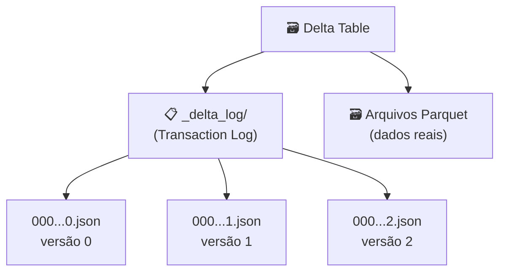

# Delta Lake

## O que é o Delta Lake?

O **Delta Lake** é uma camada de armazenamento open-source que traz confiabilidade para Data Lakes. Criado pela **Databricks** em 2019 e doado à Linux Foundation, o Delta Lake adiciona suporte a transações ACID, versionamento e execução confiável de operações DML (INSERT, UPDATE, DELETE) em cima de arquivos Parquet.

!!! info "Delta Lake = Parquet + Transaction Log"
    O Delta Lake armazena dados em arquivos **Parquet** e mantém um **Transaction Log** (pasta `_delta_log/`) com o histórico de todas as operações. Isso garante consistência e permite Time Travel.

---

## Arquitetura



### Transaction Log

Cada operação gera um arquivo JSON no `_delta_log/`:

```json
// 00000000000000000000.json (versão 0 - CREATE TABLE)
{"commitInfo": {"operation": "CREATE TABLE", "timestamp": 1705000000000}}
{"metaData": {"schemaString": "{\"type\":\"struct\",\"fields\":[...]}"}}

// 00000000000000000001.json (versão 1 - INSERT)
{"commitInfo": {"operation": "WRITE", "operationParameters": {"mode": "Append"}}}
{"add": {"path": "part-00000.parquet", "size": 2048}}
```

---

## Principais Recursos

### ACID Transactions

```python
# Todas as operações são atômicas — ou tudo é gravado ou nada é
spark.sql("INSERT INTO clientes VALUES (1, 'Ana', 'ana@email.com', 'SP', 'SP')")
spark.sql("UPDATE clientes SET email = 'ana.nova@email.com' WHERE id = 1")
spark.sql("DELETE FROM clientes WHERE id = 1")
```

### Evolução de Schema

```sql
-- Adicionar nova coluna sem recriar a tabela
ALTER TABLE clientes ADD COLUMN telefone STRING;

-- Atualizar registros com a nova coluna
UPDATE clientes SET telefone = '(11) 91234-5678' WHERE id = 1;
```

### Time Travel

Consulte versões anteriores dos dados graças ao transaction log:

```python
# Por versão (number)
df_v0 = spark.read.format("delta") \
    .option("versionAsOf", 0) \
    .load("spark-warehouse/clientes")

# Por timestamp
df_ts = spark.read.format("delta") \
    .option("timestampAsOf", "2024-01-10") \
    .load("spark-warehouse/clientes")
```

### Quando o Delta Lake se destaca

- quando o ecossistema principal é o **Spark**
- quando queremos uma curva de adoção mais simples
- quando auditoria e reprocessamento por versão são requisitos importantes

---

## Configuração com PySpark

```python
from pyspark.sql import SparkSession
from delta import *
import logging

logging.getLogger("py4j").setLevel(logging.WARNING)

spark = (
    SparkSession.builder
    .master("local[*]")
    .config("spark.jars.packages", "io.delta:delta-spark_2.12:3.2.0")
    .config("spark.sql.extensions", "io.delta.sql.DeltaSparkSessionExtension")
    .config(
        "spark.sql.catalog.spark_catalog",
        "org.apache.spark.sql.delta.catalog.DeltaCatalog",
    )
    .getOrCreate()
)
spark.sparkContext.setLogLevel("WARN")
```

---

## Operações DML Completas

### CREATE TABLE

```sql
CREATE TABLE IF NOT EXISTS clientes (
    id       INT,
    nome     STRING,
    email    STRING,
    cidade   STRING,
    estado   STRING
) USING delta;
```

### INSERT

```sql
-- Inserir múltiplos registros
INSERT INTO clientes VALUES
    (1, 'Ana Silva',       'ana@email.com',    'São Paulo',      'SP'),
    (2, 'Carlos Oliveira', 'carlos@email.com', 'Rio de Janeiro', 'RJ'),
    (3, 'Maria Santos',    'maria@email.com',  'Curitiba',       'PR');
```

### UPDATE

```sql
-- Atualizar campo específico
UPDATE produtos SET preco = 1199.00, estoque = 45 WHERE id = 2;

-- Atualizar com expressão
UPDATE pedidos SET status = 'entregue' WHERE status = 'em_transporte';
```

### DELETE

```sql
-- Deletar registros por condição
DELETE FROM pedidos WHERE status = 'cancelado';
```

### MERGE (Upsert)

```sql
MERGE INTO clientes AS target
USING (
    SELECT 6 AS id, 'Pedro Alves' AS nome, 'pedro@email.com' AS email,
           'Fortaleza' AS cidade, 'CE' AS estado, '(85) 98765-4321' AS telefone
) AS source
ON target.id = source.id
WHEN MATCHED THEN
    UPDATE SET *
WHEN NOT MATCHED THEN
    INSERT *;
```

---

## Histórico e Auditoria

```python
# Ver todo o histórico de operações
spark.sql("DESCRIBE HISTORY clientes").show(truncate=False)

# Resultado:
# +-------+-----------+------------+-------------------+
# |version|  timestamp|   operation|operationParameters|
# +-------+-----------+------------+-------------------+
# |      3|2024-01-...| MERGE       |{...}              |
# |      2|2024-01-...| UPDATE      |{...}              |
# |      1|2024-01-...| WRITE       |{mode -> Append}   |
# |      0|2024-01-...| CREATE TABLE|{...}              |
# +-------+-----------+------------+-------------------+
```

---

## DeltaTable API (Python)

```python
from delta.tables import DeltaTable

# Carregar tabela pelo caminho
dt = DeltaTable.forPath(spark, "spark-warehouse/clientes")

# Ver histórico
dt.history().show()

# Verificar se é Delta
DeltaTable.isDeltaTable(spark, "spark-warehouse/clientes")  # True

# Update via API Python
dt.update(
    condition="id = 1",
    set={"email": "'nova@email.com'"}
)

# Delete via API Python
dt.delete("status = 'cancelado'")
```

---

## Limitações e Cuidados

- O Delta Lake tem integração mais natural com Spark, então a experiência fora desse ecossistema costuma exigir mais atenção
- O transaction log cresce com o tempo e pode exigir políticas de manutenção
- O uso de `VACUUM` deve ser planejado, pois impacta retenção de versões antigas e estratégias de auditoria

---

## Dependências

```toml
# pyproject.toml
[project]
dependencies = [
    "pyspark==3.5.3",
    "delta-spark==3.2.0",
]
```

```
# Jar Maven (baixado automaticamente)
io.delta:delta-spark_2.12:3.2.0
```

Compatível com **PySpark 3.5.x** e **Scala 2.12**.
