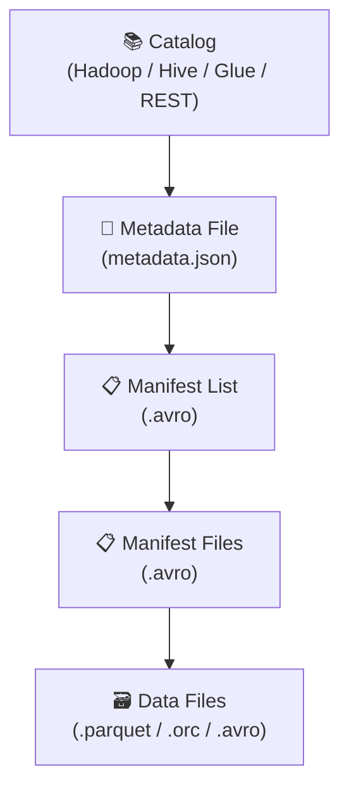

# Apache Iceberg

## O que é o Apache Iceberg?

O **Apache Iceberg** é um formato de tabela open-source de alto desempenho para grandes conjuntos de dados analíticos. Foi criado pela **Netflix** em 2017 e doado à Apache Software Foundation em 2018. Hoje é mantido por grandes empresas como Apple, Netflix, Airbnb e AWS.

!!! tip "Open Table Format"
    Iceberg é um **Open Table Format (OTF)** — uma camada de metadados que organiza arquivos de dados (Parquet, ORC, Avro) em tabelas com suporte a ACID, evolução de schema e time travel.

---

## Por que o Iceberg foi criado?

A Netflix enfrentava problemas sérios com tabelas Hive em escala petabyte:

- **Falta de ACID**: operações concorrentes corrompiam dados
- **Sem evolução de schema segura**: adicionar colunas causava falhas
- **Listagem de partições lenta**: varredura completa do S3/HDFS
- **Sem time travel**: impossível recuperar estado anterior

O Iceberg foi criado para resolver todos esses problemas.

---

## Arquitetura



| Camada | Descrição |
|---|---|
| **Catalog** | Aponta para o metadata file atual da tabela |
| **Metadata File** | JSON com schema, partições e ponteiros para manifest lists |
| **Manifest List** | Lista de manifest files de um snapshot |
| **Manifest File** | Lista de data files com estatísticas (min/max, contagem) |
| **Data Files** | Arquivos reais com os dados (Parquet por padrão) |

---

## Principais Recursos

### ACID Transactions

O Iceberg garante **atomicidade, consistência, isolamento e durabilidade** em operações DML:

```sql
-- INSERT: cria novo snapshot atomicamente
INSERT INTO local.vendas.pedidos VALUES (6, 3, 2, 1, '2024-02-01', 'processando');

-- UPDATE: cria novos arquivos, snapshot aponta para versão nova
UPDATE local.vendas.pedidos SET status = 'entregue' WHERE id = 6;

-- DELETE: remove registros sem reescrever toda a tabela
DELETE FROM local.vendas.pedidos WHERE status = 'cancelado';
```

### Evolução de Schema

Adicione, renomeie ou remova colunas sem recriar a tabela:

```sql
-- Adicionar coluna
ALTER TABLE local.vendas.clientes ADD COLUMN telefone STRING;

-- Renomear coluna (não suportado em Delta)
ALTER TABLE local.vendas.clientes RENAME COLUMN telefone TO celular;
```

### Particionamento Oculto (Hidden Partitioning)

O Iceberg gerencia partições internamente, sem que o usuário precise conhecer a estrutura:

```sql
-- Sem Iceberg (Hive): precisa especificar a partição
SELECT * FROM pedidos WHERE year(data_pedido) = 2024 AND month(data_pedido) = 1;

-- Com Iceberg: basta filtrar normalmente
SELECT * FROM local.vendas.pedidos WHERE data_pedido BETWEEN '2024-01-01' AND '2024-01-31';
```

### Time Travel (Snapshots)

```python
# Listar todos os snapshots
spark.sql("SELECT * FROM local.vendas.clientes.snapshots").show(truncate=False)

# Ler versão anterior por snapshot_id
spark.read \
    .option("snapshot-id", 1234567890) \
    .table("local.vendas.clientes").show()

# Ler por timestamp
spark.read \
    .option("as-of-timestamp", "2024-01-10 12:00:00") \
    .table("local.vendas.clientes").show()
```

### Quando o Iceberg se destaca

- quando múltiplas engines precisam ler a mesma tabela
- quando governança e portabilidade são prioridades
- quando o particionamento precisa ser mais transparente para quem consulta os dados

---

## Configuração com PySpark

```python
from pyspark.sql import SparkSession

spark = (
    SparkSession.builder
    .appName("IcebergLocalDevelopment")
    .config(
        "spark.jars.packages",
        "org.apache.iceberg:iceberg-spark-runtime-3.5_2.12:1.6.1",
    )
    .config(
        "spark.sql.extensions",
        "org.apache.iceberg.spark.extensions.IcebergSparkSessionExtensions",
    )
    .config("spark.sql.catalog.local", "org.apache.iceberg.spark.SparkCatalog")
    .config("spark.sql.catalog.local.type", "hadoop")
    .config("spark.sql.catalog.local.warehouse", "spark-warehouse/iceberg")
    .getOrCreate()
)
```

---

## Operações com Namespace e Tabelas

```sql
-- Criar namespace (schema)
CREATE NAMESPACE IF NOT EXISTS local.vendas;

-- Criar tabela
CREATE TABLE IF NOT EXISTS local.vendas.clientes (
    id     INT,
    nome   STRING,
    email  STRING
) USING iceberg;

-- Listar tabelas
SHOW TABLES IN local.vendas;
```

---

## MERGE (Upsert)

```sql
MERGE INTO local.vendas.clientes AS target
USING (
    SELECT 10 AS id, 'Novo Cliente' AS nome, 'novo@email.com' AS email
) AS source
ON target.id = source.id
WHEN MATCHED THEN
    UPDATE SET nome = source.nome, email = source.email
WHEN NOT MATCHED THEN
    INSERT (id, nome, email) VALUES (source.id, source.nome, source.email);
```

---

## Comparação: Iceberg vs Delta Lake

| Característica | Apache Iceberg | Delta Lake |
|---|---|---|
| Criador | Netflix / Apple | Databricks |
| Licença | Apache 2.0 | Apache 2.0 |
| Engines | Spark, Flink, Trino, Dremio | Principalmente Spark |
| Catálogo | Hive, Glue, REST, Nessie | spark_catalog |
| Time Travel | Snapshots (snapshot-id / timestamp) | Transaction Log (versionAsOf) |
| Schema Evolution | Avançada (rename, reorder) | Básica (add) |
| Hidden Partitioning | ✅ Sim | ❌ Não |
| Iceberg REST Catalog | ✅ Sim | ❌ Não |

---

## Versão Utilizada

```
org.apache.iceberg:iceberg-spark-runtime-3.5_2.12:1.6.1
```

Compatível com **PySpark 3.5.x** e **Scala 2.12**.

---

## Limitações e Cuidados

- A configuração inicial costuma ser mais detalhada do que em Delta Lake
- Catálogos e metadados exigem maior entendimento arquitetural da equipe
- Em projetos pequenos e puramente locais, parte do poder do Iceberg pode ficar subutilizada
