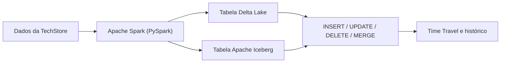
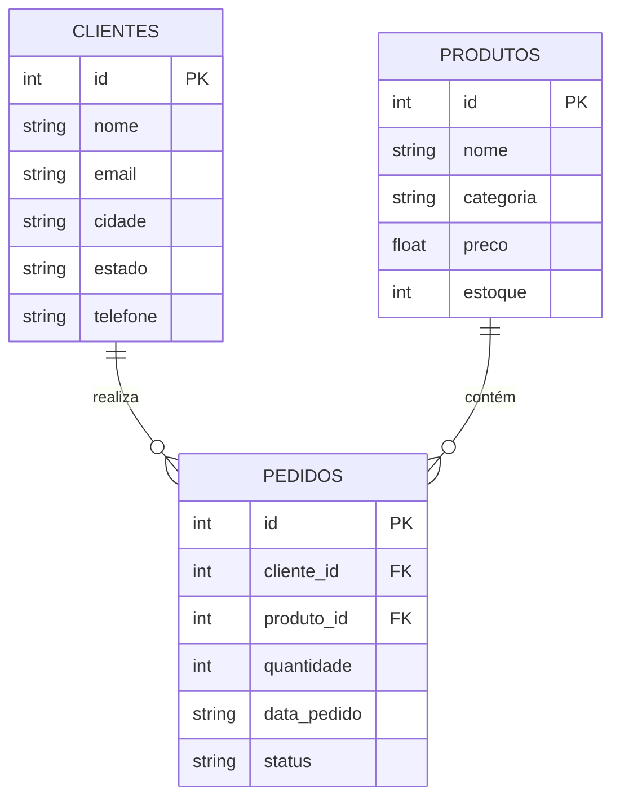

# Contexto do Trabalho

## Sobre o Projeto

Este trabalho de pesquisa foi desenvolvido para a disciplina de **Arquitetura de Dados** do curso de **Engenharia de Software (5ª Fase)** da SATC, explorando o uso do **Apache Spark** com os formatos de tabela open-source **Delta Lake** e **Apache Iceberg**.

O objetivo é demonstrar operações CRUD (INSERT, UPDATE, DELETE) e recursos avançados como **Time Travel** e **evolução de schema** em um Data Lake local usando PySpark.

### Objetivos específicos

- entender o papel do **Spark** como engine de processamento
- comparar **Delta Lake** e **Apache Iceberg** em termos de arquitetura e uso
- demonstrar operações DML em tabelas analíticas modernas
- evidenciar como ACID e versionamento melhoram a confiabilidade do Data Lake

---

## Escopo da Demonstração

Durante a apresentação, o foco do projeto é mostrar o seguinte fluxo:



---

## Cenário — TechStore

Utilizamos um sistema de gestão de vendas fictício de uma loja de eletrônicos chamada **TechStore**, contendo três entidades principais.

### Modelo Entidade-Relacionamento (ER)



---

## DDL — Definição das Tabelas

=== "Delta Lake"

    ```sql
    CREATE TABLE IF NOT EXISTS clientes (
        id       INT,
        nome     STRING,
        email    STRING,
        cidade   STRING,
        estado   STRING
    ) USING delta;

    CREATE TABLE IF NOT EXISTS produtos (
        id        INT,
        nome      STRING,
        categoria STRING,
        preco     FLOAT,
        estoque   INT
    ) USING delta;

    CREATE TABLE IF NOT EXISTS pedidos (
        id           INT,
        cliente_id   INT,
        produto_id   INT,
        quantidade   INT,
        data_pedido  STRING,
        status       STRING
    ) USING delta;
    ```

=== "Apache Iceberg"

    ```sql
    CREATE NAMESPACE IF NOT EXISTS local.vendas;

    CREATE TABLE IF NOT EXISTS local.vendas.clientes (
        id      INT,
        nome    STRING,
        email   STRING,
        cidade  STRING,
        estado  STRING
    ) USING iceberg;

    CREATE TABLE IF NOT EXISTS local.vendas.produtos (
        id        INT,
        nome      STRING,
        categoria STRING,
        preco     FLOAT,
        estoque   INT
    ) USING iceberg;

    CREATE TABLE IF NOT EXISTS local.vendas.pedidos (
        id          INT,
        cliente_id  INT,
        produto_id  INT,
        quantidade  INT,
        data_pedido STRING,
        status      STRING
    ) USING iceberg;
    ```

---

## Operações DML

### INSERT

```sql
INSERT INTO clientes VALUES
    (1, 'Ana Silva',       'ana@email.com',      'São Paulo',      'SP'),
    (2, 'Carlos Oliveira', 'carlos@email.com',   'Rio de Janeiro', 'RJ'),
    (3, 'Maria Santos',    'maria@email.com',    'Curitiba',       'PR');
```

### UPDATE

```sql
-- Atualiza status de um pedido
UPDATE pedidos SET status = 'entregue' WHERE id = 3;

-- Ajusta preço de produto
UPDATE produtos SET preco = 1199.00, estoque = 45 WHERE id = 2;
```

### DELETE

```sql
-- Remove pedidos cancelados
DELETE FROM pedidos WHERE status = 'cancelado';
```

### MERGE (Upsert)

```sql
MERGE INTO clientes AS target
USING (SELECT 6 AS id, 'Pedro Alves' AS nome, ...) AS source
ON target.id = source.id
WHEN MATCHED THEN UPDATE SET *
WHEN NOT MATCHED THEN INSERT *;
```

---

## Fonte de Dados

Os dados utilizados são **fictícios**, gerados manualmente para fins didáticos. Representam um catálogo simples de produtos eletrônicos e clientes brasileiros com seus respectivos pedidos.

---

## Resultados Esperados

Ao final da execução dos notebooks e exemplos, conseguimos observar:

- criação de tabelas em formatos modernos de lakehouse
- inserção, atualização e remoção de registros com semântica transacional
- histórico de alterações e leitura de versões anteriores
- diferenças conceituais entre um formato mais acoplado ao Spark e outro mais orientado a interoperabilidade

---

## Referências

- [Apache Spark](https://spark.apache.org/)
- [Delta Lake](https://delta.io/)
- [Apache Iceberg](https://iceberg.apache.org/)
- [Repositório referência — spark-delta (Prof. Jorge Silva)](https://github.com/jlsilva01/spark-delta)
- [Repositório referência — spark-iceberg (Prof. Jorge Silva)](https://github.com/jlsilva01/spark-iceberg)
- [Canal DataWay BR](https://www.youtube.com/@DataWayBR)
