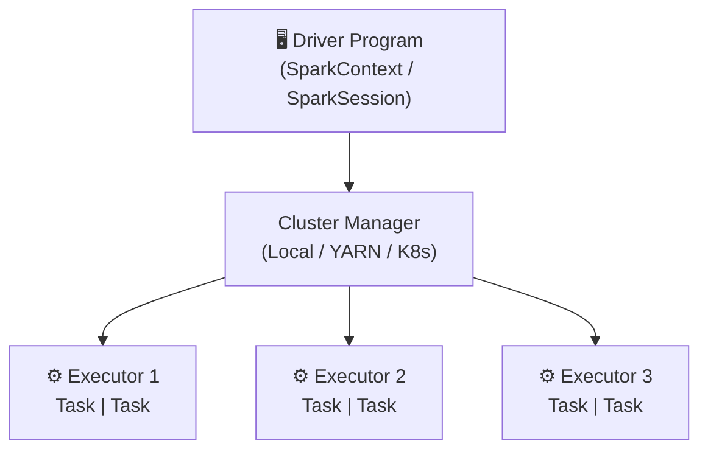

# Apache Spark (PySpark)

## O que é o Apache Spark?

O **Apache Spark** é um framework de processamento distribuído de dados de código aberto, criado em 2009 na UC Berkeley e mantido pela Apache Software Foundation. É amplamente utilizado para processamento em larga escala de dados estruturados, semi-estruturados e não estruturados.

!!! info "Por que Spark?"
    O Spark é até **100x mais rápido** que o Hadoop MapReduce para operações em memória, graças ao seu modelo de execução in-memory (RDDs e DataFrames).

---

## Arquitetura



| Componente | Descrição |
|---|---|
| **Driver** | Programa principal; coordena a execução e mantém o DAG de operações |
| **Cluster Manager** | Gerencia os recursos (local, YARN, Kubernetes, Mesos) |
| **Executor** | Processo que executa as tarefas e armazena dados em cache |
| **Task** | Unidade mínima de trabalho executada em um executor |

---

## PySpark

**PySpark** é a API Python do Apache Spark. Permite usar todo o poder do Spark com a simplicidade do Python.

### Instalação

```bash
# Via uv (gerenciador de pacotes)
uv add pyspark==3.5.3
```

### SparkSession — Ponto de entrada

A `SparkSession` é o ponto de entrada unificado do Spark 2.0+. Toda aplicação começa criando uma sessão.

```python
from pyspark.sql import SparkSession

spark = (
    SparkSession.builder
    .master("local[*]")        # usa todos os cores da máquina
    .appName("MeuApp")
    .getOrCreate()
)
```

---

## DataFrames

O DataFrame é a abstração principal do Spark — uma coleção distribuída de dados organizados em colunas (similar a uma tabela SQL ou um pandas DataFrame).

```python
# Criar DataFrame a partir de lista
dados = [("Alice", 30), ("Bob", 25), ("Carlos", 28)]
df = spark.createDataFrame(dados, ["nome", "idade"])

df.show()
# +------+-----+
# |  nome|idade|
# +------+-----+
# | Alice|   30|
# |   Bob|   25|
# |Carlos|   28|
# +------+-----+

df.printSchema()
# root
#  |-- nome: string (nullable = true)
#  |-- idade: long (nullable = true)
```

### Operações comuns

```python
from pyspark.sql.functions import col, avg, count

# Filtrar
df.filter(col("idade") > 25).show()

# Selecionar colunas
df.select("nome").show()

# Agregar
df.groupBy("categoria").agg(avg("preco"), count("id")).show()

# Ordenar
df.orderBy(col("idade").desc()).show()
```

---

## Spark SQL

O Spark SQL permite executar consultas SQL padrão em cima de DataFrames registrados como views temporárias.

```python
# Registrar como view temporária
df.createOrReplaceTempView("pessoas")

# Executar SQL
spark.sql("""
    SELECT nome, idade
    FROM pessoas
    WHERE idade > 25
    ORDER BY idade DESC
""").show()
```

---

## Leitura e Escrita de Arquivos

```python
# Ler CSV
df = spark.read.csv("data/clientes.csv", header=True, inferSchema=True)

# Ler Parquet
df = spark.read.parquet("data/produtos.parquet")

# Escrever em Parquet
df.write.mode("overwrite").parquet("output/clientes")

# Escrever em Delta Lake
df.write.format("delta").mode("overwrite").save("spark-warehouse/clientes")
```

---

## Configuração com Delta Lake e Iceberg

=== "Delta Lake"

    ```python
    from pyspark.sql import SparkSession
    from delta import *

    spark = (
        SparkSession.builder
        .master("local[*]")
        .config("spark.jars.packages", "io.delta:delta-spark_2.12:3.2.0")
        .config("spark.sql.extensions", "io.delta.sql.DeltaSparkSessionExtension")
        .config("spark.sql.catalog.spark_catalog",
                "org.apache.spark.sql.delta.catalog.DeltaCatalog")
        .getOrCreate()
    )
    ```

=== "Apache Iceberg"

    ```python
    from pyspark.sql import SparkSession

    spark = (
        SparkSession.builder
        .appName("IcebergApp")
        .config("spark.jars.packages",
                "org.apache.iceberg:iceberg-spark-runtime-3.5_2.12:1.6.1")
        .config("spark.sql.extensions",
                "org.apache.iceberg.spark.extensions.IcebergSparkSessionExtensions")
        .config("spark.sql.catalog.local", "org.apache.iceberg.spark.SparkCatalog")
        .config("spark.sql.catalog.local.type", "hadoop")
        .config("spark.sql.catalog.local.warehouse", "spark-warehouse/iceberg")
        .getOrCreate()
    )
    ```

---

## Versões Utilizadas

| Componente | Versão |
|---|---|
| Python | 3.12.3 |
| PySpark | 3.5.3 |
| Java | 17 (OpenJDK) |
| Delta Spark | 3.2.0 |
| Iceberg Runtime | 1.6.1 |
